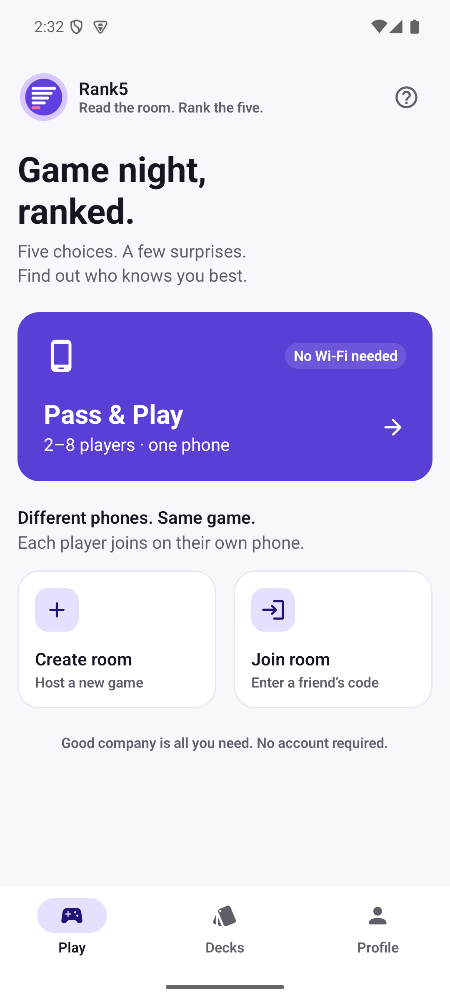
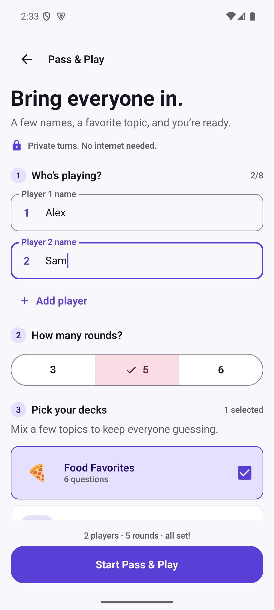
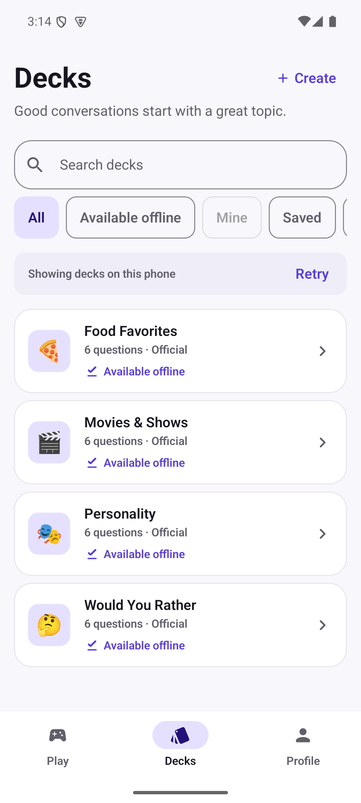

# Rank5

Multiplayer party game inspired by [rank5.io](https://rank5.io/): create a room, friends join with a code, and everyone ranks / predicts five options each round.

## Screenshots

<p align="center">
  
  
  
</p>

See the [UI / UX review](docs/UI_UX_REVIEW.md) for the evaluation, emulator verification, and additional screenshots.

## Stack

- **Backend**: Go, WebSockets (`coder/websocket`), in-memory room actors, embedded JSON decks
- **Android**: Kotlin, Jetpack Compose, Ktor WebSocket client

## Quick start — server

```bash
cd server
go test ./...
cp .env.local.example .env.local
# Configure PostgreSQL, Google OAuth, and JWT values in .env.local.
./scripts/dev-server.sh
# listens on :8080
```

The development server loads `server/.env.local` and fails fast when required
database or authentication settings are missing. Database migrations and
built-in deck seeding run automatically during startup.

E2E against a running server:

```bash
cd server
go run ./cmd/server &
go run ./scripts/e2e/
```

### HTTP API

| Method | Path | Description |
|--------|------|-------------|
| `GET` | `/health` | Health check |
| `POST` | `/rooms` | Create room → `{ "code": "ABCD" }` |
| `GET` | `/decks` | List decks |
| `GET` | `/me/stats` | Authenticated profile stats |
| `POST` | `/me/results/claim` | Attach a finished guest result to the signed-in account |
| `GET` | `/ws?code=ABCD` | WebSocket game session |

### WebSocket messages

Client → server: `join_room`, `reconnect`, `attach_account`, `start_game`, `submit_ranking`, `submit_prediction`, `skip_question`, `ready`, `next_round`, `leave_room`

Server → client: `welcome`, `room_state`, `error`

Ranking and skip commands include the rendered `roundIndex` and `questionId`, so
the server can reject delayed frames after a question changes. Only the current
subject can send `skip_question`; a successful skip replaces the question for
the whole room, clears partial submissions, preserves the deadline, and consumes
one of that subject's eight per-game skips. A skipped question is deferred to a
future round instead of consuming the room's replacement supply, so one player's
skip does not hide the action from the next subject. A question cannot cycle back
during the same round.

If a two-player game loses a socket, the authoritative room pauses for a
45-second reconnect window and freezes its round timer. `leave_room` is an
explicit departure: if fewer than two players remain, the unfinished game is
aborted without saving scores and the survivor returns to the lobby as host.
With two or more connected survivors, host ownership migrates and play continues.

## Android app

Requires **JDK 17** (not newer) and the Android SDK.

Open `android/` in Android Studio, or:

```bash
cd android
# ensure local.properties has sdk.dir=...
./gradlew :app:assembleDebug
adb install -r app/build/outputs/apk/debug/app-debug.apk
```

Default debug server URL is `http://127.0.0.1:8080` — run `adb reverse tcp:8080 tcp:8080` for each emulator (or point a physical device at your LAN IP).

Verified: debug APK builds; the full game protocol is covered by `server/scripts/e2e`.

### Play flow

1. Enter a nickname → **Create room** (share the code) or **Join room**
2. Host picks a deck and round count → **Start**
3. Each round one player is in the spotlight: everyone **Lock In** simultaneously (subject ranks honestly, others predict), then reveal + **Ready** to continue

### Offline Pass & Play

Choose **Pass & Play** on the Play screen for a local game with 2–8 people on
one Android device. Official decks are bundled in the APK, and community or
owned decks can be downloaded from the same Decks library. Pass & Play uses
everything marked **Available offline**, without a server or internet
connection. A private handoff screen hides the question and previous ranking
between every player's turn.

## Repo layout

```
server/          Go module
  cmd/server/
  internal/game/   engine + scoring
  internal/hub/    room registry
  internal/ws/     protocol + room actor
  internal/decks/  embedded JSON decks
  scripts/e2e/
android/         Compose app
```

## Phase 2 (not implemented)

Accounts, Postgres, community deck uploads / moderation — see architecture notes in the plan. Decks are loaded behind a narrow interface so the game engine does not need to change.
