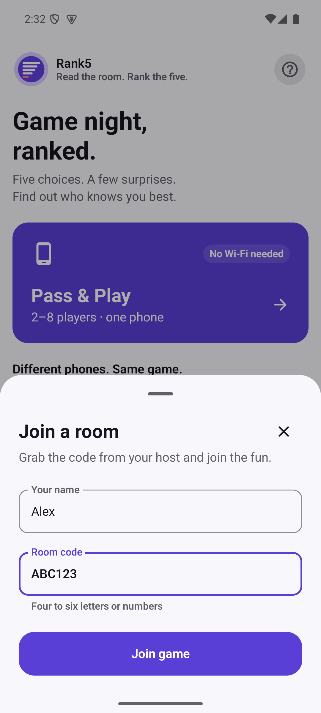
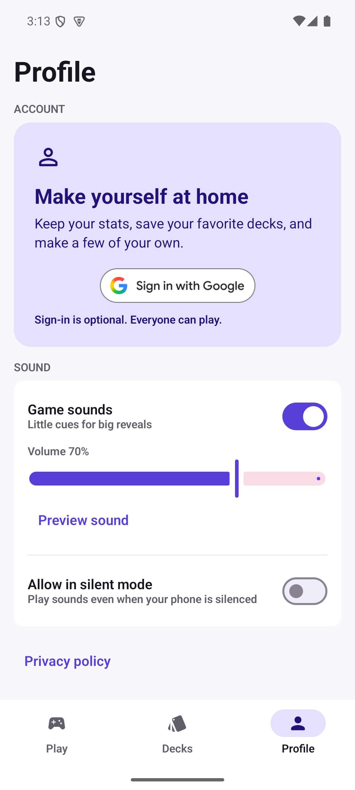
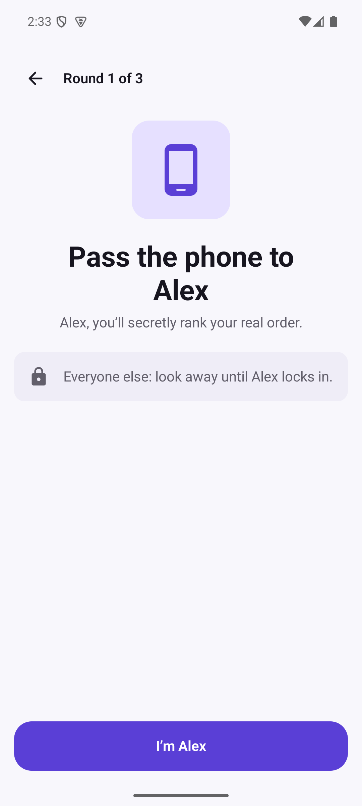
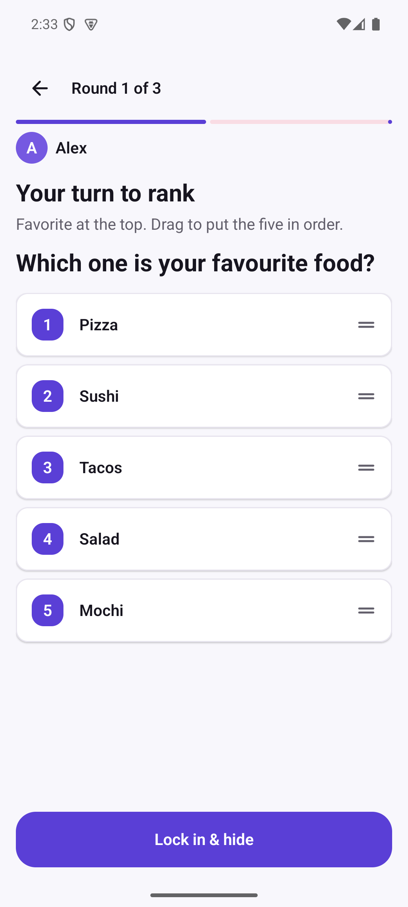
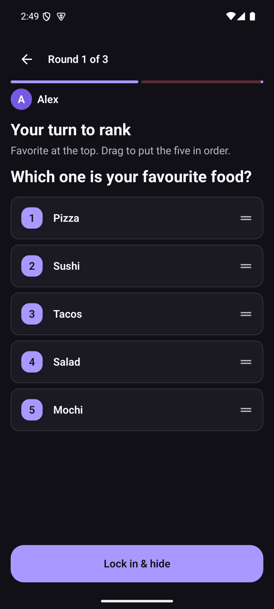
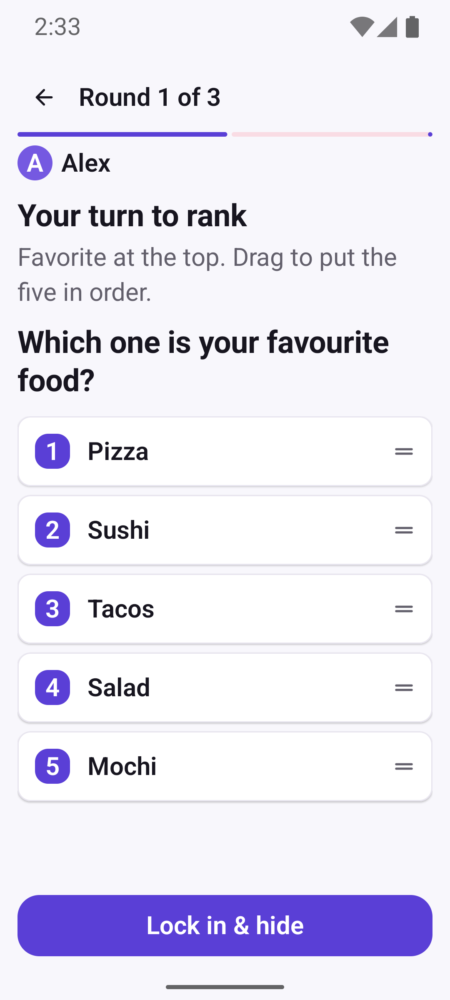

# Rank5 UI / UX review

Reviewed and updated on September 10, 2026. Screenshots below are actual Android emulator captures, not mockups.

## Assessment and changes

The original interface had a consistent palette and clear navigation, but the mode cards competed for attention, online entry expanded far down the home screen, and long deck metadata squeezed the titles. Setup repeated instructions before the useful controls.

| Area | Improvement |
| --- | --- |
| Home | A welcoming headline, a prominent Pass & Play card, readable online choices, and optional three-step game instructions. A phone icon communicates shared-device play. |
| Room entry | Dedicated bottom sheets keep names, room codes, and the main action together. Pasted codes are normalized to uppercase ASCII letters/numbers. Required inputs gate submission, keyboard actions work, and server feedback appears inside the sheet. |
| Offline setup | Three numbered sections for players, rounds, and decks. Round count is visible before the deck list. The fixed start area explains missing input and summarizes a ready game. |
| Private turns | A clear player handoff, shorter ranking instructions, and scrollable handoff content. Private rankings remain hidden between players. |
| Decks | Full-width titles, quieter metadata, offline availability on its own line, a clear-search action, and more room for the library. Search now also filters downloaded decks. A retry banner explains the local fallback. |
| Profile | A friendlier account card with concise optional-sign-in copy. Sound settings are grouped, and tapping a setting’s label toggles its switch. |
| Shared components | Consistent rounded buttons, primary-colored secondary actions, softer decorative borders, stronger input boundaries, heading semantics, and fewer duplicate navigation announcements. The shared maximum-width constraint now applies before filling the screen. |

## Verification

- Android 15 / API 35, `rank5_api35` ARM64 emulator, 1080 × 2400 at 420 dpi.
- Debug APK built and installed successfully.
- **28 unit tests passed**, with no failures or skips.
- **10 Android instrumentation tests passed**, including room-entry validation, game instructions, local deck search, labeled sound toggles, deck selection semantics, sign-in button semantics, and a complete three-round offline game with privacy checks between turns.
- Manually entered two players, selected rounds, played through handoff / ranking / reveal, and captured the real screens. The complete game and results transition were verified by instrumentation.
- Inspected ranking in light and dark mode and at **150% system font size**. All five options and the main action remained visible on the tested device. Restored the original light mode and 100% text size afterward.
- Final Android lint: **0 errors**. Remaining warnings include dependency updates, authentication lint, API compatibility, and unused audio resources; dependency or networking changes were not part of this UI pass.

Input-boundary contrast is 3.49:1 against the light background and 4.91:1 against dark surfaces. Light secondary text measures 5.85:1; the primary button label measures 6.74:1. These are calculated checks of those specific color pairs, not a full accessibility certification.

The implementation follows Android guidance for at least 48 dp interactive targets, labeled controls, state semantics, and readable contrast. See [Compose accessibility defaults](https://developer.android.com/develop/ui/compose/accessibility/api-defaults) and [Android accessibility guidance](https://developer.android.com/guide/topics/ui/accessibility/apps).

Live multiplayer connectivity and Google sign-in were not exercised: the local server was unavailable. Offline play, bundled decks, and room-entry interaction were verified. Screen-reader semantics were tested programmatically; this was not a full manual TalkBack audit or a multi-device usability study.

## Screenshots

| Home | Setup | Deck library |
| --- | --- | --- |
|  |  |  |

| Room entry | Profile | Private handoff |
| --- | --- | --- |
|  |  |  |

| Ranking | Dark mode | 150% text |
| --- | --- | --- |
|  |  |  |

[View the round reveal](screenshots/reveal.png).

## Reproduce

From `android/`, with JDK 17 and the emulator running:

```sh
./gradlew :app:testDebugUnitTest :app:connectedDebugAndroidTest :app:lintDebug
./gradlew :app:assembleDebug
```

The repository includes `android/scripts/ui_review.py` for inspecting the UI tree, selecting visible labels, entering sample names, scrolling, and capturing unmodified screenshots from `emulator-5554`.
